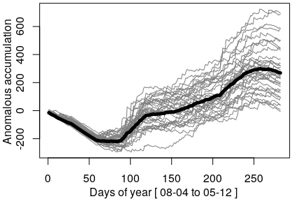
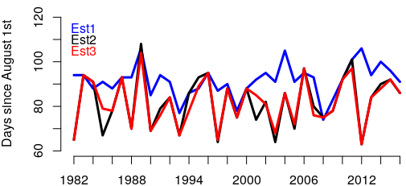

# rainfall_onset

Several appiroaches have been developed over the years for analysing the onset and cessation  of rainfall seasons. Here, it is used the method of [Zhang et al. (2018)](https://doi.org/10.5194/bg-15-319-2018) which is based on the work of [Liebmann et al. (2012)](https://doi.org/10.1175/JCLI-D-11-00157.1).

## Method

The metodology is divided in three steps: 1) calculation of the anomalous accumulation climatology wich define the start (d_i) and end (d_f) of the wet season; 2) daily cumulative rainfal anomaly in the range of d_i - wInd to d_f + wInd, where the day with minimum (maximum) value was considered as the onset (cessation) of the wet season; 3) the extreme indices are calculated in each onset-cessation range by year. The value of wInd (window) add days before and after onset and cessation respectively, according to [Zhang et al](https://doi.org/10.5194/bg-15-319-2018) is 50 (here I defined as 45), however it can be modified, the idea of wInd is that is should be enough to find the day of point 2.

## Example

Given a [sample dataset](https://github.com/adrHuerta/rainfall_onset/blob/master/data) which comes from [PISCOp](http://iridl.ldeo.columbia.edu/SOURCES/.SENAMHI/.HSR/.PISCO/.Prec/.v2p1/.stable/.daily/), it is calculated the anomalous accumulation climatology ("black") and daily cumulative rainfal anomaly by each year from 1982 to 2016 (gray) for station "Est3". Here, the axis range is from 08-04 (d_i - wInd) to 05-12 (d_f + wInd). It can be seen the changing dates by year of the onset and cessation.

  

Identified the onset-cessation range by each year of "Est3", is possible to calcule the different extreme indices, here, the numeric values of the onset for "Est3", and the other stations. Other defined indices can be computed (see example.R).

  

## References

Zhang, W., Brandt, M., Tong, X., Tian, Q., and Fensholt, R.: Impacts of the seasonal distribution of rainfall on vegetation productivity across the Sahel, Biogeosciences, 15, 319-330, https://doi.org/10.5194/bg-15-319-2018, 2018.

Liebmann, B., Bladé, I., Kiladis, G. N., Carvalho, L. M. V, Senay, G. B., Allured, D., Leroux, S., and Funk, C.: Seasonality of African precipitation from 1996 to 2009, J. Climate, 25, 4304–4322, https://doi.org/10.1175/JCLI-D-11-00157.1, 2012. 